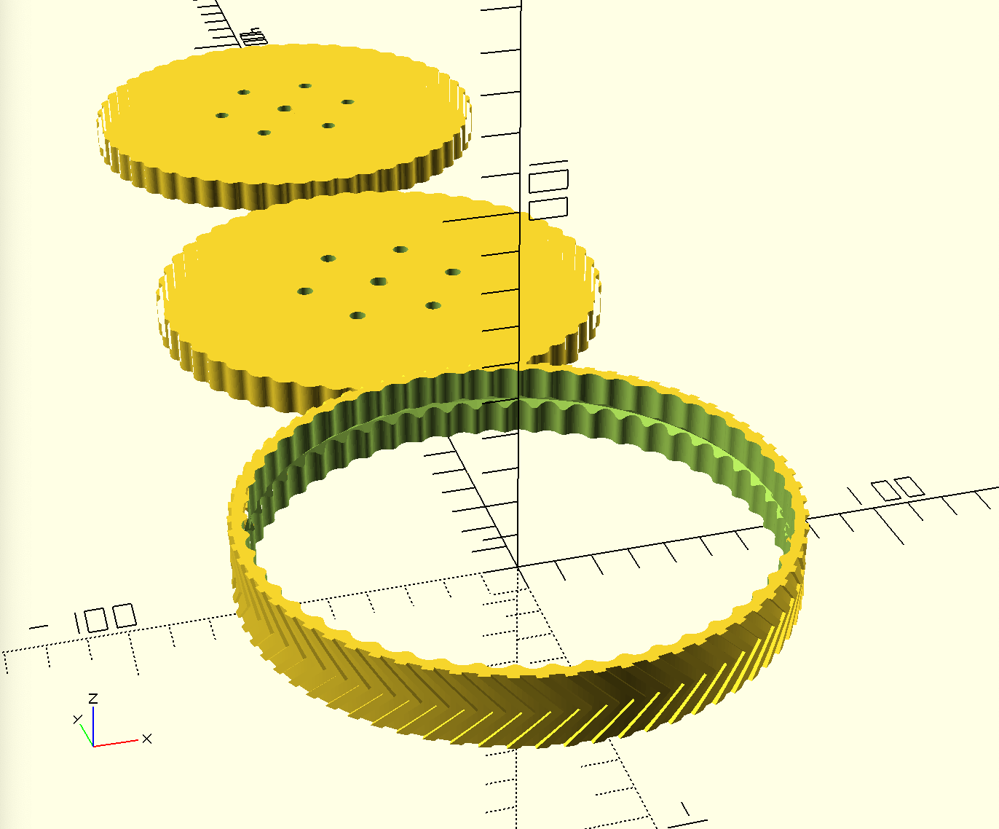
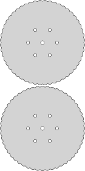

# Rubber Wheel
This is a quick design for a wheel you can use for just about anything. It consists of two centerpieces that is supposed to be laser cut from MDF or similar, and the stacked on top of each other. I suppose you could also 3D print the centers in PLA og ABS.  
The out ring is supposed to be 3D printed in a flexible material such that it can slide onto the the center pieces. The two centers can also be slid in from each side if you outer material is not flexible enough to pry on. 

## Files
**! Be aware that the two centers are NOT identical. The outer bumps are offset between the two.**  

The parts and cut file contains the parts to 3D print and cut.
 
  

  
Use the full file in your modeling so you can see the fit and size.
  