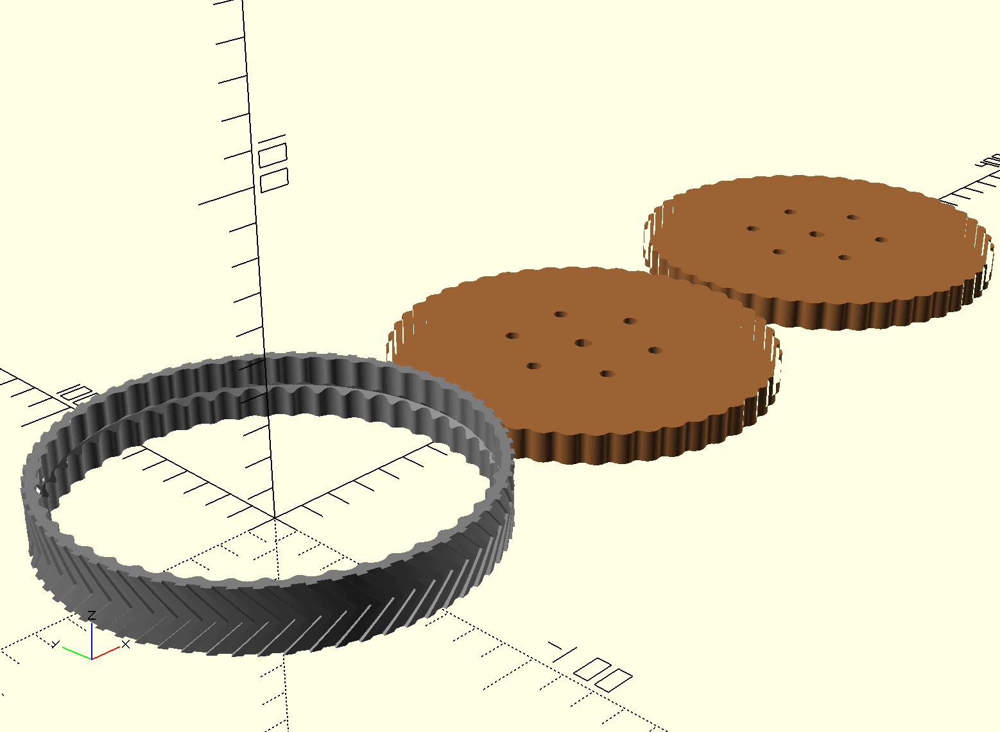
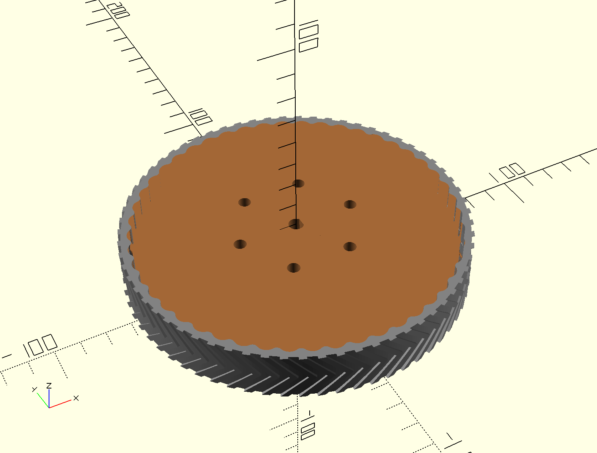

# Rubber Wheel
This is a quick design for a wheel you can use for just about anything. It consists of two centerpieces that is supposed to be laser cut from MDF or similar, and then stacked on top of each other. I suppose you could also 3D print the centers in PLA or ABS.  
The outer ring is supposed to be 3D printed in a flexible material such that it can slide onto the the center pieces and provide grip to your wheel. The two centers can also be slid in from each side if you outer material is not flexible enough to pry on. 

## Configure
The scad file has the most important parameters at the top so you can configure the size and mounting options to your needs. In the top you'll also find boolean switches to turn on or off what to render, that way you can easily render each part separately.

## Files
**! Be aware that the two centers "top" and "bottom" are NOT identical. The outer bumps are offset between the two.**  

Each part is rendered out in a separate file to make it easier to import. Below is just an example where you can see all the individual pieces.   

  

  

  
Use the full file in your modeling so you can see the fit and size.  
  

